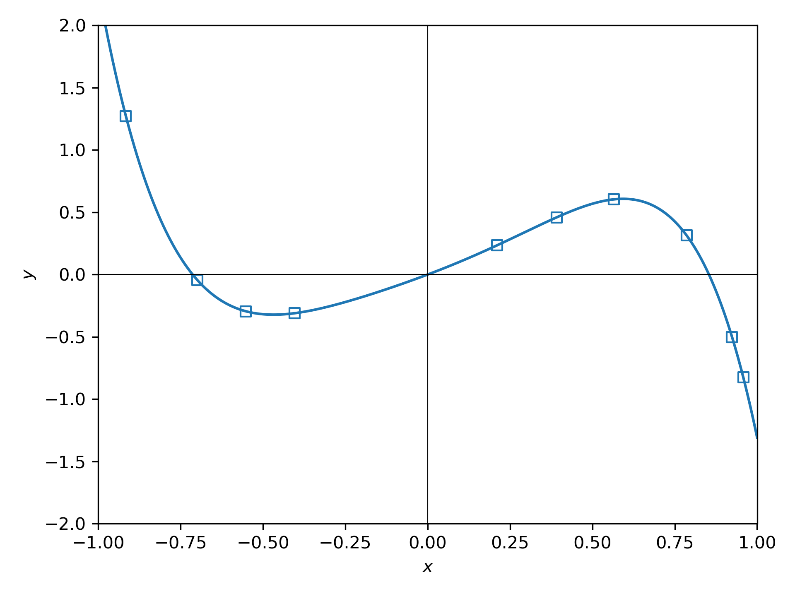

# git Tutorial

### Outline

The goal of this tutorial is to become familiar with some (of the vast) **git** functionality. It will cover the basics 
of version controlling and contributing to projects on GitHub. 

***

### Prerequisites

#### git + Python

This tutorial will require a familiarity with shells e.g. bash, and both a git & Python installs. See below to install 


|          |     Mac   |  Windows    |   Linux   |
|  :----:  |  :----  |    :----    |    :---- |
| git      |    n/a      |     Install [WSL](https://docs.microsoft.com/en-us/windows/wsl/)         |     n/a      | 
| Python   |  `wget https://repo.continuum.io/miniconda/Miniconda3-latest-Linux-x86_64.sh -O miniconda.sh && bash miniconda.sh`      |     Within WSL: `wget https://repo.continuum.io/miniconda/Miniconda3-latest-Linux-x86_64.sh -O miniconda.sh && bash miniconda.sh`         |    `wget https://repo.anaconda.com/miniconda/Miniconda3-latest-MacOSX-x86_64.sh -O miniconda.sh && bash miniconda.sh`    |

#### Python dependencies

Once Python is installed, add a couple of common Python packages (if they're not already installed)

```bash
conda install numpy matplotlib -c conda-forge
```

#### GitKraken

To interact with `git` using a graphical user interface (GUI) we'll be using GitKraken - download it [here](https://www.gitkraken.com/)
and sign in with your GitHub account.


***

### git by Example

The goal with this example will be to work together to solve a toy _research_ problem. Specifically, for a set of data 
points, what is the best fitting function? The true function and sample points (squares) are shown below.




The sample points are:

```python
xs = [ 0.21121121, -0.4034034,  0.39139139, 0.78578579, -0.55155155, 0.56556557, 0.92392392, -0.6996997, 0.95795796, -0.91591592]
ys = [ 0.23533653, -0.31035679, 0.45911638, 0.31506996, -0.29502177, 0.60401143, -0.50146046, -0.04222024, -0.82460688, 1.27242725]
```

***

#### 0. Forking

To get started **fork** this repository, aka. create a copy ('clone') of it that is now associated with your GitHub 
account. On this page hit the `Fork` button in the top right and fork it to your account.

It's on this copy that changes will be made that can then be added to the [base repository](https://github.com/duartegroup/resources).

***

#### 1. Cloning

Open GitKraken and clone your newly created fork with Clone → GitHub.com → 
Select appropriate repository → Clone the repo! 

> **_NOTE:_**  You'll need to be logged into GitHub in GitKraken for this to work!

***

#### 2. Making Changes

Finally, we're now ready to make some progress in solving the toy problem. Open up `fit_function.py` with your favourite 
text editor or IDE. Modify the trial function declaration to try and minimise the difference between your guess and 
the true values, subject to some simple regularisation. A simple trial function is defined

```python

def function(x, c):
    """
    Example function:  y = c_0 x^2
    ...
    """
    return c[0] * x**2
```

where `c` is a list of parameters of the function. **The true function is a polynomial** so the parameters are just
a set of coefficients. Running the script (`python fit_function.py`) will plot the trial function over the sample data 
and print the errors e.g. for c_0 = 0.5:

```bash
Error(f)  =  2.01524
Error(c)  =  10.98072
```

***

#### 3. Committing

Once you've made a change that improves the errors **commit** the changes. Return to GitKraken and 1. Stage the changes, 
2. Write a commit message (e.g. "Reduces error on function") and 3. Hit Commit changes. Each commit provides a snapshot
of the current state which can be reverted to at any time. A good rule of thumb is to commit anything that feels like it
could be summarised in a single sentence.

***

#### 4. Pushing

With committed changes on your local copy of the repository you can now **push** them to the remote (GitHub) by, in 
GitKraken, hitting `Push` (top middle). The new changes should now be visible on your GitHub profile homepage.

***

#### 5. Pull Requests

With pushed changes to a remote we can now create a **pull request** (PR) into the base _duartegroup_ repository. To 
do so, navigate to the `Pull requests` tab on [GitHub](https://github.com/duartegroup/resources) and open a PR from your
fork to the base repository.

Opening a PR will notify the maintainer of the repository that there are changes that you would like to contribute 
to the main (base) repository. When opening a PR it's useful to add what the purpose is, and in this case some data to 
support that here the values of the errors will be important!

***

#### 6. Rebasing

**TODO**
